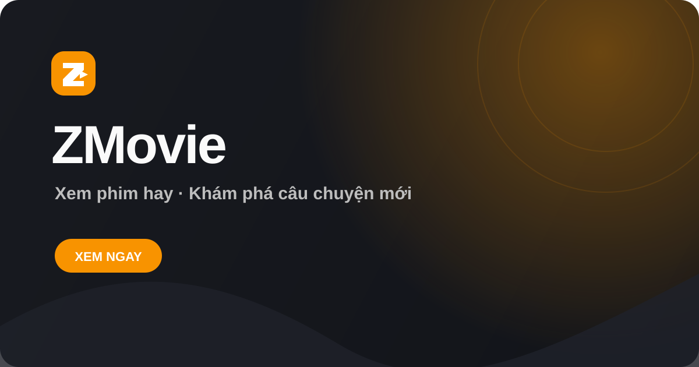
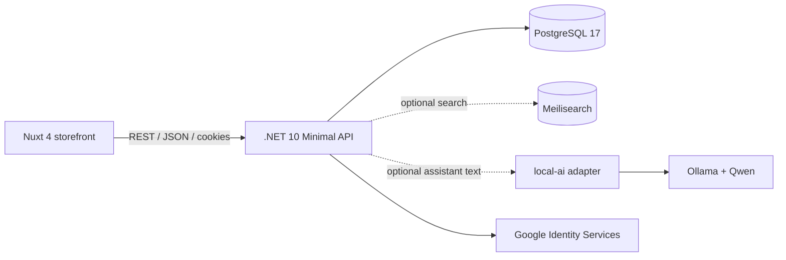

# ZMovie

> A full-stack movie discovery and streaming platform built as a portfolio project.

[](https://movie.ziet.dev)
[](backend/)
[](frontend/)
[](backend/compose.yaml)

ZMovie combines a Vietnamese-first movie storefront with a modular .NET API. It supports catalog discovery, search, HLS playback, Google sign-in, personal libraries, reviews, an admin area, and a personalized movie assistant backed by a small local AI service.



## Live demo

- Website: [movie.ziet.dev](https://movie.ziet.dev)
- API documentation: available from the development API at `/scalar` and `/openapi/v1.json`

The public demo is intended to show the product experience. Some features, including administration and personalized recommendations, require authentication.

## Features

### Viewer experience

- Home discovery feed with featured and trending titles.
- Movie and series catalog with Vietnamese and English metadata.
- Genre browsing, search, detail pages, and episode playback.
- HLS video playback with watch progress tracking.
- Google Identity Services sign-in with an encrypted session cookie.
- Personal library, saved titles, viewing history, and reviews.
- Responsive Nuxt UI designed for desktop and mobile screens.

### Personalization and AI

- Mood- and intent-aware assistant chat.
- Personalized discovery based on saved titles and watch history.
- Deterministic local TF-IDF recommendation ranking.
- Optional Ollama integration through the `local-ai/` adapter.
- The AI text generator explains recommendations; catalog title IDs remain controlled by the backend.

### Administration

- Role-based admin access using explicit `member` and `admin` roles.
- Catalog overview and operational counters.
- Title, genre, user, and review management.
- Safe admin guardrails for role changes and last-admin protection.

### Backend capabilities

- Catalog and discovery APIs under `/v1`.
- PostgreSQL persistence with EF Core migrations.
- Meilisearch integration with PostgreSQL fallback search.
- OpenAPI and Scalar documentation in development.
- Health endpoints for liveness and readiness checks.
- OPhim catalog and genre import commands for development data.
- Optional Infisical-backed production configuration.

## Architecture



The backend is organized as a modular monolith with explicit dependency direction:

```text
ZMovie.Api
  ├── ZMovie.Application       use cases, MediatR, validation, contracts
  ├── ZMovie.Domain            catalog, identity, engagement entities
  ├── ZMovie.Infrastructure    EF Core, PostgreSQL, search, seed data, integrations
  └── ZMovie.ServiceDefaults   OpenTelemetry and shared service defaults
```

The frontend is a Nuxt 4 application using Vue 3, Tailwind CSS, shadcn-vue-compatible UI components, and HLS.js for video playback.

## Technology stack

| Area | Technologies |
| --- | --- |
| Frontend | Nuxt 4, Vue 3, TypeScript, Tailwind CSS, Reka UI, HLS.js |
| Backend | .NET 10, ASP.NET Core Minimal APIs, C#, MediatR, FluentValidation |
| Data | PostgreSQL 17, Entity Framework Core, Meilisearch |
| Identity | Google Identity Services, ASP.NET Core cookie authentication |
| AI | Local TF-IDF recommendation model, Ollama, Qwen 3 0.6B |
| Tooling | Docker Compose, .NET Aspire, OpenAPI, Scalar, GitLab CI |
| Deployment | Nuxt static output / Cloudflare Pages, containerized API deployment |

## Repository structure

```text
.
├── backend/
│   ├── src/
│   │   ├── ZMovie.Api/             HTTP endpoints and composition root
│   │   ├── ZMovie.Application/     use cases and application contracts
│   │   ├── ZMovie.Domain/          domain entities and rules
│   │   ├── ZMovie.Infrastructure/  persistence and external integrations
│   │   ├── ZMovie.AppHost/         .NET Aspire AppHost
│   │   └── ZMovie.ServiceDefaults/ shared observability defaults
│   ├── tests/ZMovie.Api.Tests/     unit and application tests
│   ├── compose.yaml                local PostgreSQL service
│   └── scripts/                    development and catalog import scripts
├── frontend/
│   ├── app/pages/                  storefront, player, account, and admin pages
│   ├── app/components/             reusable UI components
│   ├── app/composables/            API, auth, SEO, and playback composables
│   └── public/                     static assets and routing rules
├── local-ai/                       optional Ollama bridge for assistant text
├── docs/                           architecture notes and code audit reports
└── .gitlab/ci/                     frontend and backend CI pipelines
```

## Local development

### Prerequisites

- .NET 10 SDK
- Node.js 20+ and npm, or Bun
- Docker Desktop / Docker Engine with Compose
- Optional: Ollama for the local movie assistant

### 1. Clone and install dependencies

```bash
git clone https://github.com/ndviet0303/zmovie.git
cd zmovie

dotnet restore backend/ZMovie.slnx

cd frontend
npm install
cd ..
```

### 2. Start PostgreSQL

```bash
docker compose -f backend/compose.yaml up -d
```

The development database is exposed at `localhost:5433` with these local-only defaults:

```text
Database: zmovie
Username: zmovie
Password: zmovie
```

### 3. Configure the API connection

The API requires the `ConnectionStrings__ZMovie` configuration key. Export a local development value in your shell:

```bash
export ConnectionStrings__ZMovie='Host=localhost;Port=5433;Database=zmovie;Username=zmovie;Password=zmovie'
```

For the frontend, copy the example environment file if you need to override the API or Google client configuration:

```bash
cp frontend/.env.example frontend/.env.local
```

Never commit `.env.local`, production credentials, database passwords, or Infisical machine secrets.

### 4. Start the API and frontend

The development API automatically applies migrations and seeds sample catalog data when running with the Development environment.

```bash
bash backend/scripts/dev.sh
```

Local URLs:

- Frontend: <http://localhost:3000>
- API: <http://localhost:5275>
- Scalar API reference: <http://localhost:5275/scalar>
- OpenAPI document: <http://localhost:5275/openapi/v1.json>
- API health: <http://localhost:5275/health/ready>

Press `Ctrl+C` to stop both development processes.

### Run services separately

```bash
# Terminal 1 — API
dotnet run --project backend/src/ZMovie.Api --launch-profile http

# Terminal 2 — frontend
cd frontend
npm run dev
```

## Catalog import

The backend includes explicit scripts for importing development catalog data from OPhim. The import commands migrate the database before they exit.

```bash
# Import genres
bash backend/scripts/import-ophim-genres.sh

# Import all available catalog pages with episode data
bash backend/scripts/import-ophim-catalog.sh --with-episodes

# Import a smaller sample while developing
bash backend/scripts/import-ophim-catalog.sh --max-pages 10 --with-episodes
```

To limit concurrent detail requests, set `OPHIM_CONCURRENCY`:

```bash
OPHIM_CONCURRENCY=2 bash backend/scripts/import-ophim-catalog.sh --with-episodes
```

## Optional local AI assistant

The AI adapter is intentionally separate from the API. It forwards a sanitized recommendation context to Ollama and returns a short explanation; the backend still owns the actual recommendation IDs and catalog cards.

```bash
ollama serve
ollama pull qwen3:0.6b

cd local-ai
npm install
npm start
```

The adapter listens on `http://localhost:8788` and Ollama listens on `http://localhost:11434` by default. Local development enables the adapter at `http://127.0.0.1:8788`.

Useful overrides:

```bash
LOCAL_AI_HOST=0.0.0.0
LOCAL_AI_PORT=8788
OLLAMA_URL=http://127.0.0.1:11434
OLLAMA_MODEL=qwen3:0.6b
```

## API overview

Public endpoints include:

```text
GET  /v1/discovery/home
GET  /v1/discovery/top/{period}
GET  /v1/catalog/titles
GET  /v1/catalog/titles/{slug}
GET  /v1/catalog/titles/{slug}/playback
GET  /v1/catalog/genres
GET  /v1/search
GET  /health/live
GET  /health/ready
```

Authenticated endpoints cover Google sign-in, the user library, saved titles, watch progress, reviews, personalized discovery, assistant context/chat, and assistant feedback. Admin endpoints are protected by the `ZMovie.Admin` policy.

The complete contract is generated at runtime as OpenAPI in Development. Use the Scalar reference for interactive exploration.

## Quality checks

Frontend checks:

```bash
cd frontend
npm run lint
npm run typecheck
npm run build

# Requires Bun because the repository's test script uses Bun's test runner.
bun test app/lib
```

Backend checks:

```bash
dotnet build backend/ZMovie.slnx
dotnet test backend/ZMovie.slnx
```

## Configuration

Development uses normal .NET configuration providers. Important keys include:

```text
ConnectionStrings__ZMovie
FrontendOrigin
Google__ClientId
Meilisearch__Url              optional
Meilisearch__ApiKey           optional
LocalAi__Enabled              optional
LocalAi__BaseUrl              optional
Admin__Emails__0              optional bootstrap allowlist
```

Production configuration is designed for an external secret manager such as Infisical. Keep credentials outside source control, container images, and CI logs. See [docs/backend-architecture.md](docs/backend-architecture.md) for the production configuration model, authentication flow, admin bootstrap rules, and module boundaries.

## Project status

ZMovie is an active portfolio project. The catalog, discovery, identity, engagement, admin, and assistant vertical slices are implemented. Media processing, object storage, background jobs, Redis, and additional operational modules remain planned areas for future iterations.

## License

No open-source license has been added yet. All rights are reserved unless otherwise stated.
